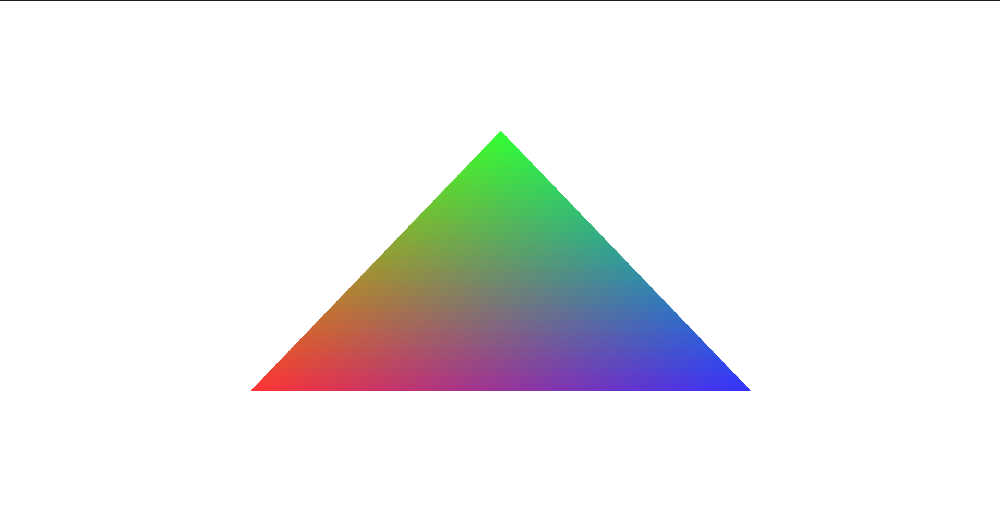

# Obem
*A Gera library for 3D browser games.*

This library aims provides simple and easy-to-use bindings for WebGL and the Web Audio API for games written in [the Gera programming language](https://github.com/geralang).

### Example

Below is a simple triangle example, and what it looks like when viewed in a web browser:

```
mod example

use obem::gfx::*

proc main() {
    obem::on_init(start)
}

proc start() {
    var triangle = Mesh([
        -0.5, -0.5, 0.0,  1.0, 0.2, 0.2,
         0.0,  0.5, 0.0,  0.2, 1.0, 0.2,
         0.5, -0.5, 0.0,  0.2, 0.2, 1.0
    ], [0, 1, 2])
    var shader = Shader("
        attribute vec3 coords;
        attribute vec3 color;
        varying vec3 fcolor;

        void main(void) {
            gl_Position = vec4(coords, 1.0);
            fcolor = color;
        }
    ", "
        precision highp float;
        varying vec3 fcolor;
        
        void main(void) {
            gl_FragColor = vec4(fcolor, 1.0);
        }
    ")
    obem::on_frame(|| {
        main_surface() .> clear_color(1.0, 1.0, 1.0, 1.0)
        render(triangle, [3, 3], shader, false, main_surface())
    })
}
```
